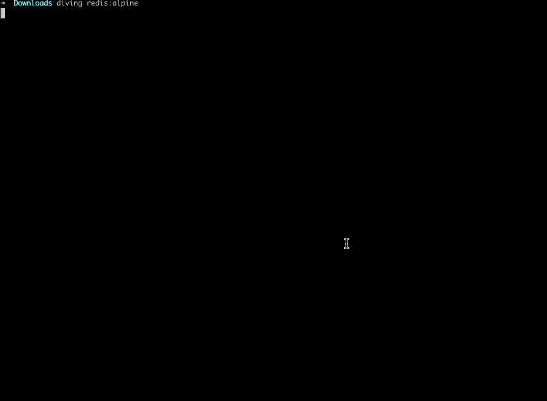
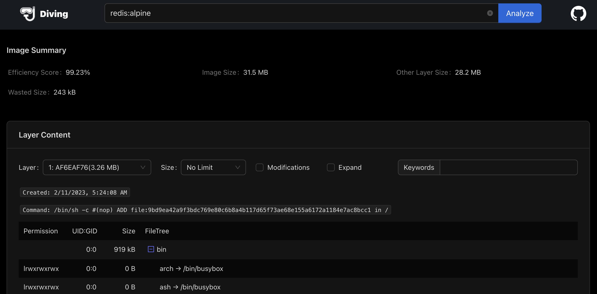

# diving-rs

[](https://github.com/vicanso/diving-rs/releases)
[](https://hub.docker.com/r/vicanso/diving)
[](./LICENSE)

[English](./README.md)

**深入 Docker 镜像的每一层 —— 几秒钟定位浪费空间、泄漏密钥与体积膨胀。**

一个快速、独立的 Rust 二进制：直接从任意 registry 拉取镜像，看清里面到底装了什么。**无需 Docker daemon、无需 root、零依赖。** 支持 Linux、macOS 与 Windows。



## 为什么选 diving？

- ⚡ **快且独立** —— 单个静态二进制。可从 Docker Hub / 任意 V2 registry、本地 docker 客户端或 `.tar` 文件读取镜像。分层自动缓存，下载中断自动续传。
- 🔍 **逐层文件浏览** —— 交互式 TUI 遍历每一层的文件系统，新增 / 修改 / 删除的文件以颜色区分。
- 📉 **浪费与膨胀检测** —— 效率评分、浪费字节、跨层重复文件、超大层、包管理器缓存、开发/构建产物，并反推 Dockerfile 做反模式 lint。
- 🛡️ **安全卫生检查** —— 标记泄漏的密钥文件（`.env`、SSH / 云厂商密钥、证书）、`ENV`/label/Dockerfile 中的硬编码凭证（仅报字段名，绝不回显值）、setuid 与全局可写文件，以及以 root 运行的容器。
- 🤖 **AI 优化报告** —— 把完整分析交给任意 OpenAI 兼容模型，得到按优先级排序的修复清单，并支持版本间的劣化对比。
- 🚦 **CI 卡口** —— 镜像效率 / 浪费字节低于阈值时让流水线失败。
- 🌐 **终端 · Web · MCP · JSON / Markdown · 企微** —— 交互浏览、暴露 HTTP API 或供 AI agent 调用的 MCP 端点、导出报告，或推送到群聊。

> **能力边界说明：** diving 聚焦于体积、结构与基础安全检查（密钥泄漏、文件权限、是否以 root 运行等）。它扫描文件**路径**与镜像元数据 —— **不做** CVE/漏洞扫描，也**不扫描文件内容**。漏洞覆盖请配合 Trivy / grype / docker scout 使用。

## 快速开始

```bash
# 1. 安装 —— 任选其一：
curl -fsSL https://raw.githubusercontent.com/vicanso/diving-rs/main/install.sh | sh   # 预编译二进制
cargo install diving                                                                  # 从 crates.io 安装

# 2. 开始分析
diving redis:alpine
```

就这么简单 —— 无需 Docker daemon。Linux / macOS / Windows 的预编译二进制也可在 [release page](https://github.com/vicanso/diving-rs/releases) 下载；也可用 `cargo install --git https://github.com/vicanso/diving-rs` 从源码安装最新版。

TUI 内快捷键：

| 按键 | 作用 |
|------|------|
| `1` | 仅显示当前层 `修改` / `删除` 的文件 |
| `2` | 仅显示 ≥ 1 MB 的文件 |
| `Esc` / `0` | 重置显示模式 |

## 分析任意镜像

diving 支持三种数据源：

```bash
# 来自 registry（默认）—— Docker Hub、quay.io、私有 registry…
diving redis:alpine
diving quay.io/prometheus/node-exporter

# 为多架构镜像指定架构
diving redis:alpine?arch=arm64

# 来自本地 docker 客户端
diving docker://redis:alpine

# 来自导出的 tar 包
diving file:///tmp/redis.tar
```

## 导出报告

```bash
# JSON —— 完整分析结果，外加 efficiencyScore / wastedSize / wastedPercent
diving redis:alpine --output-file result.json

# Markdown（通过 .md 后缀自动识别）
diving redis:alpine --output-file result.md

# 将 Markdown 输出到控制台 —— 默认自动识别并隐藏基础镜像层
diving myimage:latest --output-file -

# 包含基础镜像层
diving myimage:latest --output-file - --no-skip-base
```

## CI 卡口

在 CI 中运行 diving 以保持镜像精简。设置 `CI=true` 后，它会输出效率评分，并在任一阈值超标时**以退出码 `1` 退出**（见[退出码](#退出码)）。

```bash
CI=true diving redis:alpine
```

阈值可在 `~/.diving/config.yml` 中配置，也可以用 `--config` 指定配置文件，方便把卡口规则和代码放在一起：

```bash
CI=true diving --config .diving.yml myimage:latest
```

| 选项 | 默认值 | 含义 |
|------|--------|------|
| `lowest_efficiency` | `0.95` | 最低可接受的效率评分（0–1） |
| `highest_wasted_bytes` | `20971520`（20 MB） | 最大允许浪费字节数 |
| `highest_user_wasted_percent` | `0.1` | 最大允许浪费比例（0–1） |
| `fail_on_severity` | —（关闭） | 存在该严重度及以上的优化建议时同样判定失败：`high`、`medium`、`low` 或 `info` |

默认情况下，优化建议（泄漏的密钥文件、以 root 运行等）只打印，不影响退出码。设置 `fail_on_severity: high` 后，镜像里打包了私钥这类问题会让流水线失败。`medium` 及以下还会把启发式建议（Dockerfile lint、文档/locale 文件等）算进去，噪音会更多。值写错时 diving 会在启动时直接报错退出，而不是悄悄关掉这项检查。

### 退出码

| 退出码 | 含义 |
|--------|------|
| `0` | 通过 |
| `1` | 镜像没有通过卡口（上面的阈值或 `fail_on_severity`） |
| `2` | diving 自身失败：镜像拉取或分析失败、配置有误、AI 或企微调用失败等 |

设置 `CI=true` 时，即使配置了 [AI 分析](#ai-分析) 或 [企微推送](#企微推送)，卡口同样生效：diving 先发送报告，再执行检查。

### 接受已知问题

每条建议都有一个固定的 id，CI 输出里显示在括号中，JSON 里是 `id` 字段。把已经评估并接受的问题写进 `ignore_recommendations`，它们仍会打印（标注「已忽略」），但不再参与 `fail_on_severity` 判定（上面三项阈值不受影响）：

```yaml
fail_on_severity: high
ignore_recommendations:
  - secfiles
```

| Id | 建议 | 严重度 |
|----|------|--------|
| `secfiles` | 镜像中疑似存在密钥 | 高 |
| `secmeta` | 镜像元数据中的密钥（ENV / label / Dockerfile） | 高 |
| `worldread` | 所有人可读的密钥文件 | 高 |
| `runtimecompat` | 启动二进制与基础镜像的 libc 不兼容 | 高（musl 二进制运行在 glibc 镜像时为中） |
| `wasted` | 回收浪费的空间 | 中（浪费比例超过 10% 时为高） |
| `crossdup` | 跨层重复文件 | 低（达到 5 MB 为中，达到 50 MB 为高） |
| `pkgcache` | 清理包管理器缓存 | 中 |
| `devart` | 排除开发/构建产物 | 中 |
| `runasroot` | 容器以 root 运行 | 中 |
| `setuid` | setuid/setgid 二进制文件 | 中 |
| `worldwrite` | 所有人可写的文件 | 中 |
| `oversized` | 超大镜像层 | 低或中 |
| `dflint` | Dockerfile 反模式 | 低或中 |
| `layercount` | 减少镜像层数 | 低 |
| `junk` | 编辑器/系统垃圾文件 | 低 |
| `slimbase` | 考虑更精简的基础镜像 | 低 |
| `buildonly` | 运行时镜像中的纯构建期文件 | 低 |
| `doclocale` | 文档 / man / locale 数据 | 低 |
| `logtemp` | 打进镜像的日志 / 临时文件 | 低 |
| `toolchain` | 最终镜像中存在构建工具链 | 低 |
| `bigfiles` | 近期层中新增的大文件 | 提示 |
| `netreclaim` | 净可回收空间估算 | 提示 |

## AI 分析

提供 OpenAI 兼容的 API Key 后，diving 会将完整的 Markdown 分析（分层、反推的 Dockerfile、浪费空间、大文件、安全发现）发送给模型，并打印按优先级排序的优化报告，而不进入交互式 TUI。当 `ENTRYPOINT`/`CMD` 指向镜像内脚本时，会从分层读取该脚本一并发送，便于模型审查容器实际运行的逻辑。

```bash
# 启用 AI 分析（打印报告，跳过 TUI）
diving redis:alpine --ai-api-key sk-xxxx

# 自定义接口地址与模型
diving redis:alpine \
  --ai-api-key sk-xxxx \
  --ai-base-url https://your-gateway/v1 \
  --ai-model gpt-4o

# 通过环境变量配置
export OPENAI_API_KEY=sk-xxxx
diving redis:alpine

# 控制报告语言（同时影响终端 / Markdown 输出）
diving redis:alpine --ai-api-key sk-xxxx --lang zh
```

| 参数 | 环境变量 | 默认值 | 说明 |
|------|----------|--------|------|
| `--ai-api-key` | `OPENAI_API_KEY` | — | OpenAI 兼容的 API Key。提供该参数即启用 AI 分析。 |
| `--ai-base-url` | `OPENAI_BASE_URL` | `https://api.openai.com/v1` | 接口地址，也可直接传入完整的 `.../chat/completions` 地址。 |
| `--ai-model` | `OPENAI_MODEL` | `gpt-4o` | 模型名称。 |
| `--ai-system-prompt` | `OPENAI_SYSTEM_PROMPT` | 内置 DevSecOps 模板 | 覆盖系统提示词，完全替换内置模板。 |
| `--lang` | `DIVING_LANG` | 系统语言 | 输出语言：`en` 或 `zh`。 |
| `--no-ai-history` | — | 关闭 | 本次跳过劣化对比（快照仍会刷新）。 |

每次运行会将本次分析快照保存到 `~/.diving/ai_history/`。下次分析同一镜像时，会把上一次快照与本次一并发送给模型，便于识别新老版本间的体积劣化/膨胀。`--no-ai-history` 可在单次运行中跳过该对比（例如基线已过期）；快照仍会刷新，后续运行将以本次为基线。

> 安全提示：API Key、接口地址与 webhook **仅支持 CLI/环境变量** —— 不会作为 web 查询参数接收，因此不会落入访问日志。

## 企微推送

指定企业微信群机器人 webhook，即可把结果直接推送到群里，而不进入交互式 TUI。推送内容会智能选择，确保不超过机器人 ~4096 字节的 markdown 上限：

- 已设置 `--ai-api-key` → 推送精简的 AI 报告
- 未启用 AI → 推送精简摘要（效率评分、浪费空间、优化建议）

设置 `CI=true` 时，消息开头会带上 [CI 卡口](#ci-卡口)的结论：通过，或未通过及具体是哪几项检查没过。这样在群里就能看到结果，不用再去翻流水线。

```bash
# 使用机器人 key（自动展开为标准 webhook 地址）
diving redis:alpine --wecom-webhook 693a91f6-7aoc-4bc4-97a0-0ec2sifa5aaa

# 或使用完整 webhook 地址
diving redis:alpine --wecom-webhook "https://qyapi.weixin.qq.com/cgi-bin/webhook/send?key=KEY"

# 推送 AI 报告而非摘要
diving redis:alpine --ai-api-key sk-xxxx --wecom-webhook KEY

# 也可通过环境变量提供
export WECOM_WEBHOOK=KEY
diving redis:alpine
```

| 参数 | 环境变量 | 默认值 | 说明 |
|------|----------|--------|------|
| `--wecom-webhook` | `WECOM_WEBHOOK` | — | 企业微信群机器人 webhook 地址，或裸 key（自动展开）。提供该参数即推送结果并跳过 TUI。 |

超长内容会截断到企微上限并附 `… (truncated)` 提示。

## Web 模式

将 diving 作为带 React 前端的 HTTP 服务运行，用于远程分析。

```bash
# 创建数据目录并将所有权授予容器内用户（UID/GID 均为 1000）
mkdir -p $PWD/diving
chown -R 1000:1000 $PWD/diving

docker run -d --restart=always \
  -p 7001:7001 \
  -v $PWD/diving:/home/rust/.diving \
  --name diving \
  vicanso/diving
```

在浏览器中打开 `http://127.0.0.1:7001/` 即可。



容器以非 root 身份（UID `1000:1000`）运行；上方的 `chown` 让它能写入 layer 缓存（省略会导致启动失败）。镜像基于 `debian:trixie-slim`，另带 CA 证书包；不含 `tzdata`，时间一律按 UTC 显示。由于默认不含 `wget`/`curl`，未设置 in-image `HEALTHCHECK` —— 请改用编排层探针访问 `GET /ping`（Kubernetes `livenessProbe`、sidecar 等）。

通过 `--listen` 修改监听地址：

```bash
diving --mode web --listen 0.0.0.0:8080
```

### API

#### `GET /api/analyze`

分析 Docker 镜像并返回结果。

| 参数 | 类型 | 必填 | 说明 |
|------|------|------|------|
| `image` | string | 是 | 镜像引用（格式与命令行模式相同） |
| `format` | string | 否 | 设为 `markdown` 时返回 Markdown 报告，默认返回 JSON |
| `skipBase` | bool | 否 | 当 `format=markdown` 时，自动识别并隐藏基础镜像层（默认 `true`）；设为 `false` 则包含 |

```bash
# JSON 响应（默认）
curl "http://127.0.0.1:7001/api/analyze?image=redis:alpine"

# 指定架构
curl "http://127.0.0.1:7001/api/analyze?image=redis:alpine%3Farch%3Darm64"

# Markdown 报告
curl "http://127.0.0.1:7001/api/analyze?image=redis:alpine&format=markdown"

# Markdown 报告并包含基础镜像层（默认隐藏）
curl "http://127.0.0.1:7001/api/analyze?image=myimage:latest&format=markdown&skipBase=false"
```

### MCP

Web 模式同时在 `/mcp` 提供 [MCP](https://modelcontextprotocol.io) 服务（Streamable HTTP 传输），Claude Code 等 AI agent 可以直接调用它分析镜像：

```bash
claude mcp add --transport http diving http://127.0.0.1:7001/mcp
```

Web 界面页头的 **MCP** 按钮会给出同样的接入说明，并按你当前访问的地址自动填好：接入地址、Claude Code 命令、其它客户端用的 JSON 配置，都可以一键复制。如果当前地址会被下面的 `Host` 校验拒绝，弹窗里也会提示。

| 工具 | 返回内容 |
|------|----------|
| `analyze_image` | Markdown 分析报告（与 `format=markdown` 相同） |
| `get_findings` | JSON 格式的结论：效率分、浪费空间、优化建议、敏感文件、重复文件、运行时兼容性、各层概要 |
| `list_files` | 分页的文件列表，可按层、目录、关键字、大小过滤 |
| `read_file` | 读取某一层中的文本文件（最多 256 KiB，仅支持 registry 镜像） |
| `latest_images` | 最近分析过的镜像 |

层号从 1 开始，与报告中的编号一致。MCP 调用与 `/api/analyze` 共用分析缓存、并发请求去重和 `registry_allowlist`。首次分析大镜像可能需要几分钟；如果客户端带了 progress token，diving 会每 10 秒发一次进度通知。

访问控制：

- 默认只接受 `Host` 为 loopback（`localhost`、`127.0.0.1`、`::1`）的请求，用来防御网页发起的 DNS rebinding 攻击。要给远程客户端使用，二选一：
  - 用 `--mcp-token <token>`（或 `$DIVING_MCP_TOKEN`）设置 token。之后每个请求都必须带 `Authorization: Bearer <token>`，同时不再校验 `Host`：
    ```bash
    claude mcp add --transport http diving https://diving.example.com/mcp \
      --header "Authorization: Bearer <token>"
    ```
  - 在 `~/.diving/config.yml` 中用 `mcp_allowed_hosts: [diving.example.com]` 放行你的域名（配成 `"*"` 则关闭校验）。
- `--no-mcp` 关闭该端点。

Docker 镜像监听的是 `0.0.0.0`，要给远程 MCP 客户端使用，可以通过环境变量传入 token，例如 `docker run -e DIVING_MCP_TOKEN=<token> …`。同一台主机上的客户端直接用 `http://127.0.0.1:7001/mcp` 即可，不需要 token。

## 敏感文件扫描

分析过程中，diving 会对每个文件**路径**执行内置规则扫描（`.env` 文件、SSH 私钥、AWS/GCP 凭证、TLS 私钥、kubeconfig、`.htpasswd`、误拷入的 `.git` 目录等），命中结果以 **Security Warnings** 形式出现在报告中。（它扫描路径与元数据，不扫描文件内容。）

可通过创建 `~/.diving/sensitive-files` 扩展或屏蔽规则，每行一条：

| 行格式 | 作用 |
|--------|------|
| `<glob-pattern>` | 将匹配文件标记为敏感（原因显示为 "Custom sensitive file"） |
| `<glob-pattern> \| <原因>` | 标记为敏感并附加自定义原因 |
| `!<glob-pattern>` | 忽略/屏蔽匹配项（同时覆盖内置规则与上方自定义规则） |

`#` 开头及空行会被跳过。Glob 大小写不敏感；`*` 可跨目录分隔符匹配，同时也会对文件名单独匹配，因此 `*.pem` 能命中 `a/b/cert.pem`。

```
# ── 额外规则 ─────────────────────────────────────────────────
**/*.vault-token | Vault token
**/app-secrets.json | 应用密钥

# ── 屏蔽内置规则中的误报 ──────────────────────────────────────
!**/.env.example
!**/.env.template
!**/certs/nginx.crt
!**/testdata/**
!**/fixtures/**
```

## 配置

配置文件：`~/.diving/config.yml`。可以用 `--config <文件>`（`-c`）或 `$DIVING_CONFIG` 指定其它文件，命令行参数优先于环境变量。这样指定的文件必须存在，否则 diving 会报错退出，而不是回退到默认值；文件一律按 YAML 解析，与扩展名无关。改变的只是配置文件的位置，`sensitive-files`、`ai_history/` 和默认缓存目录仍在 `~/.diving/` 下。

| 选项 | 默认值 | 说明 |
|------|--------|------|
| `layer_path` | `~/.diving/layers` | layer blob 缓存目录 |
| `layer_ttl` | `90d` | layer blob **与**分析结果缓存的有效期；超过该时长未访问则清除 |
| `analysis_path` | `~/.diving/analysis` | 分析结果缓存目录 |
| `cleanup_interval_hours` | `1` | 扫描并清除过期缓存的间隔（小时） |
| `layer_concurrency` | `min(层数, 2 × CPU 数)` | 每个镜像并发拉取 + 解压 layer 的任务数。网络快且层数多时调大，与其它负载共享主机时调小 |
| `worker_threads` | CPU 核数 | Tokio 运行时的工作线程数。web 服务需要同时处理较多请求时调大 |
| `threads` | — | 旧的单一配置项：上面两项未设置时，同时作为它们的取值 |
| `lowest_efficiency` | `0.95` | CI 检查 —— 最低效率评分（0–1） |
| `highest_wasted_bytes` | `20971520` | CI 检查 —— 最大浪费字节数（20 MB） |
| `highest_user_wasted_percent` | `0.1` | CI 检查 —— 最大浪费比例（0–1） |
| `fail_on_severity` | — | CI 检查 —— 存在该严重度及以上的优化建议时失败（`high` / `medium` / `low` / `info`）；不配置则建议不影响结果 |
| `ignore_recommendations` | — | CI 检查 —— 不参与 `fail_on_severity` 判定的建议 id（见[接受已知问题](#接受已知问题)） |
| `registry_allowlist` | — | Web 模式：非空时，`/api/analyze` 和 MCP 只接受这些 registry 的镜像（如 `index.docker.io`、`ghcr.io`）；要允许 `file://` / `docker://` 需加入 `local-file` / `local-docker` |
| `max_download_file_size` | `104857600` | Web 模式：`/api/file` 单个文件的大小上限（100 MB） |
| `analysis_memory_ttl` | `1m` | Web 模式：分析结果在内存中保留的时长。这段时间内对同一镜像的请求不再访问 registry，直接返回；代价是同一个 tag 被重新推送后，最多要等这么久才能看到新结果。设为 `0s` 关闭 |
| `max_concurrent_analyses` | — | Web 模式：最多同时分析多少个不同的镜像，超出的请求排队等待。不配置则不限制 |
| `max_layer_cache_size` | — | layer 缓存的总大小上限；超出时按最近访问时间从旧到新淘汰。不配置则只按 TTL 清理 |
| `mcp_allowed_hosts` | — | Web 模式：`/mcp` 在 loopback 之外额外放行的 `Host`（配成 `"*"` 关闭校验；设置了 `--mcp-token` 时忽略） |

```yaml
layer_ttl: 30d
cleanup_interval_hours: 6
layer_concurrency: 4
lowest_efficiency: 0.95
highest_wasted_bytes: 20971520
highest_user_wasted_percent: 0.1
```

## 缓存机制

diving 在 `~/.diving/` 下维护两层缓存，均受 `layer_ttl` 控制并每小时清理一次：

- **Layer blobs**（`~/.diving/layers/`）—— 从 registry 下载的压缩 layer，按 layer digest 索引。命中时省去网络下载，但解压与文件树构建仍会运行。
- **分析结果**（`~/.diving/analysis/`）—— 完整的分析结果，以「`HEAD` 镜像 manifest 返回的 `Docker-Content-Digest` + 架构」为键。命中时整条流水线被短路。

分析缓存是**内容寻址**的：`:latest` 这类可变 tag 被重新推送时，digest 变化，缓存条目自动失效。如果 `HEAD` 探测因任何原因失败，diving 会静默回退到完整分析 —— 缓存绝不会阻塞请求。

**registry 不可用时。** 如果 registry 连不上、过载（5xx）或对请求限流（429），而同一个镜像引用之前分析过，diving 会显示那次缓存的分析结果，而不是报错。终端、Markdown 报告、web 界面和 JSON（`staleAsOf` 字段）都会注明这份结果的生成时间，因为这个 tag 现在可能已经指向别的镜像。registry 自己返回的错误（401、403、404）不会这样处理；CI 也不会：设置 `CI=true` 时卡口必须按镜像的当前状态判定，所以会以退出码 `2` 失败。

> 由于分层数据需从镜像源（如 Docker Hub）下载，首次分析大镜像可能较慢。下载中断会自动续传。对于私有化部署的 registry，请将 diving（或其 web 镜像）运行在可访问该 registry 的主机上。

## 许可证

基于 [Apache License 2.0](./LICENSE) 开源。
