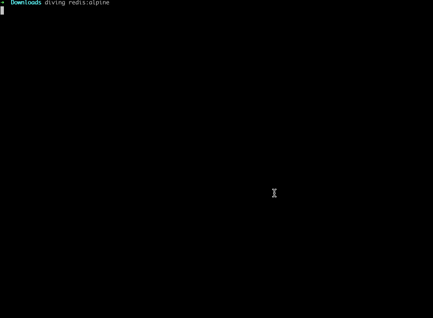

# diving-rs

用于展示docker镜像的每一层文件列表，它更快更简单。它支持两种模式：命令行（默认模式）以及web模式。它无需依赖任何东西，包括docker客户端。

## config

默认配置文件为`~/.diving/config.yml`，其配置选项如下：

- `layer_path`: 分层数据缓存的目录，默认为`~/.diving/layers`
- `layer_ttl`: 分层数据缓存的有效期, 默认为`90d`

## terminal

```bash
diving redis:alpine

diving quay.io/prometheus/node-exporter
```

- `Current Layer Contents` 仅显示当前层的所有文件
- `Press 1` 仅显示当前`修改或删除` 的文件
- `Press 2` 仅显示当前层大于1MB的文件
- `Press Esc or 0` 重置显示模式 



## web

```bash
docker run -d --restart=always \
  -p 7001:7001 \
  -v $PWD/diving:/home/rust/.diving \
  --name diving \
  vicanso/diving
```

在浏览器中打开`http://127.0.0.1:7001/`即可。

