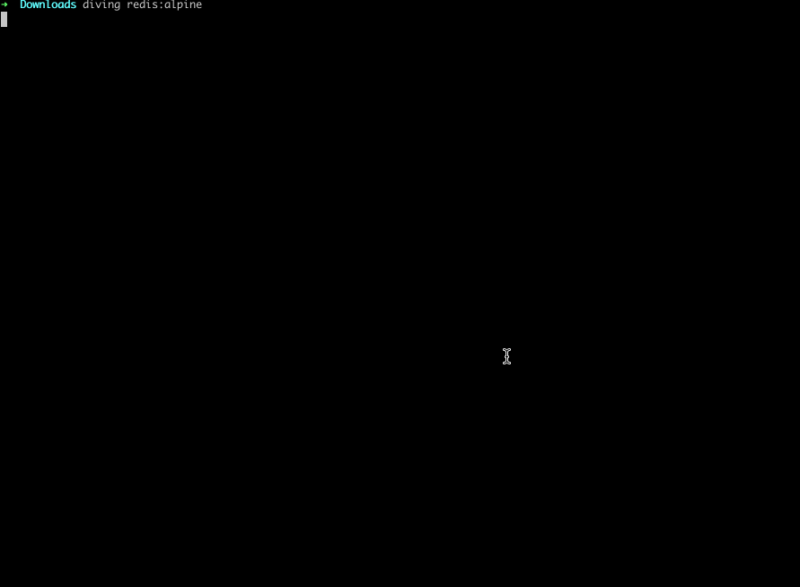
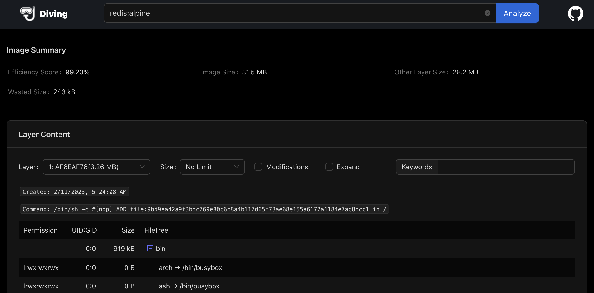

# diving-rs

[中文](./README-zh.md)

Exploring each layer in a docker image, it's fast and simple, developed with Rust. There are two modes: terminal(default) and web. 

It does not depend on anything, including docker client.

It supports multiple platforms: linux, windows and macos, you can get it from [release page](https://github.com/vicanso/diving-rs/releases).

Note: Since the layer data needs to be downloaded from the source, such as Docker Hub, it may take a long time, if times out, please try again, it is recommended that the download program be executed locally. For image sources deployed privately, you can deploy the image of Diving on a machine that can access the image source.

## config

The config file is `~/.diving/config.yml`, the options:

- `layer_path`: The path of layer cache, default is `~/.diving/layers`
- `layer_ttl`: The ttl of layer, default is `90d`. The layer will be purged if it is not accessed again for 90 days

## terminal

```bash
diving redis:alpine

diving quay.io/prometheus/node-exporter
```

- `Current Layer Contents` only show the files of current layer
- `Press 1` only show the `Modified/Removed` files of current layer
- `Press 2` only show the files >= 1MB
- `Press Esc or 0` reset the view mode



## web

```bash
docker run -d --restart=always \
  -p 7001:7001 \
  -v $PWD/diving:/home/rust/.diving \
  --name diving \
  vicanso/diving
```

It should be noted that the image does not run with root, so the mounted directory needs to add the permissions, otherwise it will fail to start.

Open `http://127.0.0.1:7001/` in the browser.

