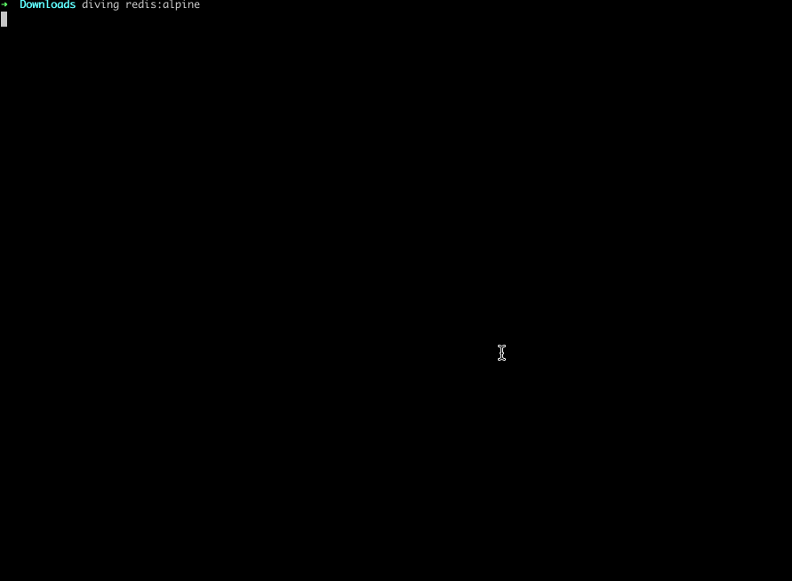
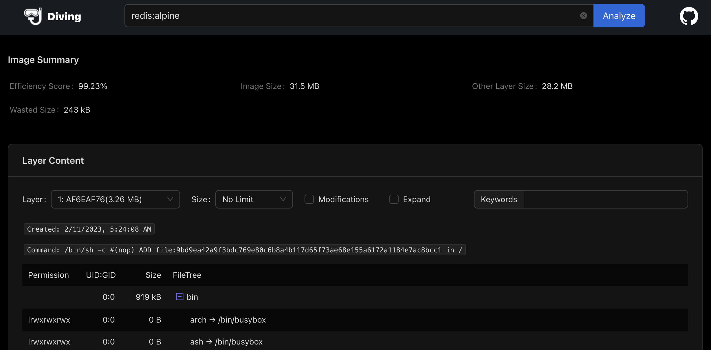

# diving-rs

[中文](./README-zh.md)

Exploring each layer in a docker image, it's fast and simple, developed with Rust. There are two modes: terminal(default) and web. 

It does not depend on anything, including docker client.

It supports multiple platforms: linux, windows and macos, you can get it from [release page](https://github.com/vicanso/diving-rs/releases).

Note: Since the layer data needs to be downloaded from the source, such as Docker Hub, it may take a long time. Interrupted downloads of large layers are retried automatically and resume from where they stopped; if it still fails, please try again. It is recommended that the download program be executed locally. For image sources deployed privately, you can deploy the image of Diving on a machine that can access the image source.


## Installation

```bash
curl -fsSL https://raw.githubusercontent.com/vicanso/diving-rs/main/install.sh | sh
```


## config

The config file is `~/.diving/config.yml`, the options:

- `layer_path`: The path of layer cache, default is `~/.diving/layers`
- `layer_ttl`: The TTL of cached layer blobs AND analysis results, default is `90d`. An entry is purged if it has not been accessed for the specified duration
- `analysis_path`: The path of the analysis-result cache, default is `~/.diving/analysis`
- `cleanup_interval_hours`: How often (in hours) the caches are scanned for expired entries, default is `1`
- `threads`: Concurrent layer fetch + decompression tasks, default is `min(layers.len(), 2 × logical CPUs)`. Setting it explicitly always wins (raise on fast networks with lots of layers, lower if other workloads share the host)
- `lowest_efficiency`: CI check — minimum acceptable efficiency score (0–1), default is `0.95`
- `highest_wasted_bytes`: CI check — maximum wasted bytes, default is `20971520` (20 MB)
- `highest_user_wasted_percent`: CI check — maximum wasted percentage (0–1), default is `0.1`

Example `~/.diving/config.yml`:

```yaml
layer_ttl: 30d
cleanup_interval_hours: 6
threads: 4
lowest_efficiency: 0.95
highest_wasted_bytes: 20971520
highest_user_wasted_percent: 0.1
```

## cache

diving keeps two on-disk caches under `~/.diving/`, both governed by `layer_ttl` and swept hourly:

- **Layer blobs** (`~/.diving/layers/`) — compressed layer downloads from the registry, keyed by layer digest. A hit skips the network download; decompression and file-tree construction still run.
- **Analysis results** (`~/.diving/analysis/`) — fully analyzed `DockerAnalyzeResult` JSON, keyed by the `Docker-Content-Digest` returned by a `HEAD` against the manifest endpoint plus the requested architecture. A hit short-circuits the entire pipeline (no layer fetch, no decompression, no file-tree walk).

The analysis cache is **content-addressable**, so re-pushing a mutable tag like `:latest` automatically invalidates the entry. If the `HEAD` probe fails for any reason (network, 4xx/5xx, missing header) diving silently falls back to the full analysis — caching never blocks a request.

## sensitive-files

During analysis, diving scans every file path against a set of built-in rules (`.env` files, SSH private keys, AWS credentials, TLS certificates, etc.) and reports matches in the analysis output under **Security Warnings**.

You can extend or suppress these checks by creating `~/.diving/sensitive-files`. Each line is one rule:

| Line format | Effect |
|-------------|--------|
| `<glob-pattern>` | Flag matching files as sensitive (reason: "Custom sensitive file") |
| `<glob-pattern> \| <reason>` | Flag with a custom reason label |
| `!<glob-pattern>` | Ignore / suppress matches (overrides both built-in rules and custom patterns above) |

Lines starting with `#` and blank lines are ignored. Glob patterns are case-insensitive; `*` matches across directory separators, and patterns are also tested against the filename alone, so `*.pem` matches `a/b/cert.pem`.

Example `~/.diving/sensitive-files`:

```
# ── Extra patterns ───────────────────────────────────────────
**/*.vault-token | Vault token
**/app-secrets.json | Application secrets

# ── Suppress built-in rules for intentional inclusions ───────
!**/.env.example
!**/.env.template
!**/certs/nginx.crt
!**/testdata/**
!**/fixtures/**
```

## terminal

Supports three data source modes analyze image. The specific form is as follows:

- `registry` get image form docker registry or other registry
- `docker` get image from local docker client
- `file` get image for tar file

```bash
diving redis:alpine

# specify architecture
diving redis:alpine?arch=arm64

diving quay.io/prometheus/node-exporter

diving docker://redis:alpine

diving file:///tmp/redis.tar

# CI mode — prints efficiency score and exits with code 1 if checks fail
CI=true diving redis:alpine

# save analysis result to a JSON file
diving redis:alpine --output-file result.json

# save analysis result as Markdown (detected by .md extension)
diving redis:alpine --output-file result.md

# print Markdown to stdout (base image layers auto-detected and hidden by default)
diving myimage:latest --output-file -

# add --no-skip-base to include the base image layers
diving myimage:latest --output-file - --no-skip-base
```

- `Current Layer Contents` only show the files of current layer
- `Press 1` only show the `Modified/Removed` files of current layer
- `Press 2` only show the files >= 1MB
- `Press Esc or 0` reset the view mode



## AI analysis

Provide an OpenAI-compatible API key to get an AI-generated optimization report instead of the interactive TUI. diving sends the full Markdown analysis (layers, reconstructed Dockerfile, wasted space, large files, security findings) to the model and prints its diagnosis to stdout. When the ENTRYPOINT/CMD points to a script inside the image, that script's content is read from the layers and included so the model can review what the container actually runs.

```bash
# enable AI analysis (prints the report, skips the TUI)
diving redis:alpine --ai-api-key sk-xxxx

# custom OpenAI-compatible endpoint and model
diving redis:alpine \
  --ai-api-key sk-xxxx \
  --ai-base-url https://your-gateway/v1 \
  --ai-model gpt-4o

# key / endpoint / model can also come from the environment
export OPENAI_API_KEY=sk-xxxx
diving redis:alpine

# control the report language (also affects terminal/Markdown output)
diving redis:alpine --ai-api-key sk-xxxx --lang zh
```

| Flag | Environment | Default | Description |
|------|-------------|---------|-------------|
| `--ai-api-key` | `OPENAI_API_KEY` | — | OpenAI-compatible API key. Providing it enables AI analysis. |
| `--ai-base-url` | `OPENAI_BASE_URL` | `https://api.openai.com/v1` | API base URL. A full `.../chat/completions` URL is also accepted. |
| `--ai-model` | `OPENAI_MODEL` | `gpt-4o` | Model name. |
| `--lang` | `DIVING_LANG` | system locale | Output language: `en` or `zh`. |
| `--no-ai-history` | — | off | Skip reading the previous snapshot, so the report does no regression comparison this run. The current analysis is still recorded as the new baseline. |

Each run stores a snapshot of the analysis under `~/.diving/ai_history/`. On the next run of the same image, the previous snapshot is sent alongside the current one so the model can flag size regressions / bloat between versions. Pass `--no-ai-history` to skip that comparison for one run (e.g. when the stored baseline is stale or unrelated); the snapshot is still refreshed so subsequent runs compare against this one.

## WeCom push

Pass a WeCom (企业微信) group-bot webhook to push the result straight into a chat instead of opening the TUI. Content is chosen smartly so it always fits the bot's ~4096-byte markdown limit:

- with `--ai-api-key` set → the concise AI report is pushed
- without AI → a short summary (efficiency score, wasted space, optimization recommendations)

```bash
# push using the bot key (expanded to the standard webhook URL)
diving redis:alpine --wecom-webhook 693a91f6-7aoc-4bc4-97a0-0ec2sifa5aaa

# or the full webhook URL
diving redis:alpine --wecom-webhook "https://qyapi.weixin.qq.com/cgi-bin/webhook/send?key=KEY"

# push the AI report instead of the summary
diving redis:alpine --ai-api-key sk-xxxx --wecom-webhook KEY

# the webhook can also come from the environment
export WECOM_WEBHOOK=KEY
diving redis:alpine
```

| Flag | Environment | Default | Description |
|------|-------------|---------|-------------|
| `--wecom-webhook` | `WECOM_WEBHOOK` | — | WeCom group-bot webhook URL, or a bare bot key (expanded automatically). Providing it pushes the result and skips the TUI. |

Oversized content is truncated to the WeCom limit with a `… (truncated)` marker.

## web

```bash
# Create the data directory and grant ownership to the container user (UID/GID 1000)
mkdir -p $PWD/diving
chown -R 1000:1000 $PWD/diving

docker run -d --restart=always \
  -p 7001:7001 \
  -v $PWD/diving:/home/rust/.diving \
  --name diving \
  vicanso/diving
```

The container runs as a non-root UID (`1000:1000`). The `chown` command above grants ownership of the host directory to that UID — without it the container cannot write layer cache files and will fail to start.

The image is based on `debian:bookworm-slim` (glibc runtime with shell + apt for `docker exec` debugging; `ca-certificates` and `tzdata` installed at build time). Because the image ships no `wget`/`curl` by default, no Dockerfile-level `HEALTHCHECK` is set — probe `GET /ping` from your orchestrator instead (Kubernetes `livenessProbe`, an external `curl` sidecar in Docker Compose, etc.), or install `wget`/`curl` in a derived image to re-enable an in-image probe.

To change the listen address, pass `--listen`:

```bash
diving --mode web --listen 0.0.0.0:8080
```

Open `http://127.0.0.1:7001/` in the browser.



### API

#### `GET /api/analyze`

Analyze a Docker image and return the result.

| Parameter | Type | Required | Description |
|-----------|------|----------|-------------|
| `image` | string | yes | Image reference (same formats as terminal mode) |
| `format` | string | no | Set to `markdown` to return a Markdown report instead of JSON |
| `skipBase` | bool | no | When `format=markdown`, auto-detect and hide base image layers (default `true`); set `false` to include them |

**Examples:**

```bash
# JSON response (default)
curl "http://127.0.0.1:7001/api/analyze?image=redis:alpine"

# specify architecture
curl "http://127.0.0.1:7001/api/analyze?image=redis:alpine%3Farch%3Darm64"

# Markdown report
curl "http://127.0.0.1:7001/api/analyze?image=redis:alpine&format=markdown"

# Markdown report including base layers (hidden by default)
curl "http://127.0.0.1:7001/api/analyze?image=myimage:latest&format=markdown&skipBase=false"
```